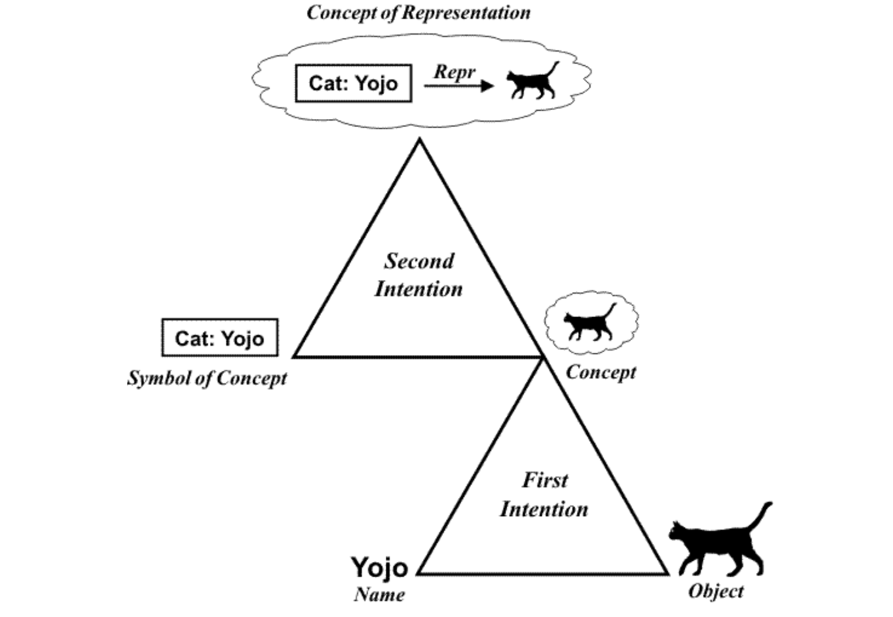
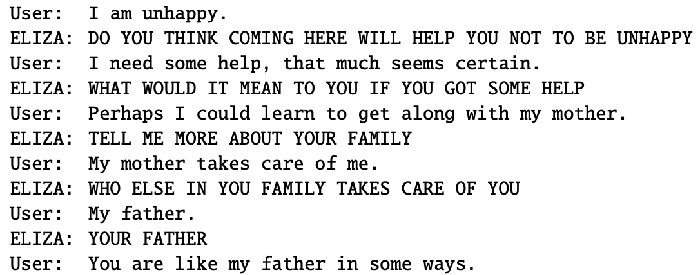

## 1. Large language models (LLMs), Artificial Intelligence (AI) and Natural language processing (NLP), history of NLP

>  Explanations, formulas, visualisations: 
> - Britannica entry for [artificial intelligence](https://www.britannica.com/technology/artificial-intelligence) 
> - Eisenstein 1.1
> - Jurafsky-Martin [2](https://web.stanford.edu/~jurafsky/slp3/2.pdf) 

&nbsp; 

### NLP at the intersection of three disciplines 

- NLP is an important part of artificial intelligence because language is the most prominent capacity of human intelligence. 

#### La différence entre l'intelligencde artificielle et le machine Learning est que l'intelligence artificielle est une discipline qui vise à créer des machines capables de simuler l'intelligence humaine. Le machine learning est une sous-discipline de l'intelligence artificielle qui se concentre sur le développement de programmes informatiques qui peuvent changer lorsqu'ils sont exposés à de nouvelles données. 

#### Tous les modes de communication ne sont pas considérés comme du langage. 
#### Le langage est caractérisé par la complexité de sa structure. 
#### Dans d’autres systèmes , par exemple ceux utilisés par les animaux les plantes etc , le langage est limité au réel . Le langage humain quant-à lui permet non seulement de parler de la réalité , mais aussi d’inventer une réalité , mentir raconter etc et pas seulement communiquer.

- Another reason why language is central to AI is the famous Turing test. Not a test in fact,but a thought experiment.

#### le test de turing est un test dans lequel une machine est évaluée par des humains sur la nature de ses réponses à des questions posées par des humains. Si les humains ne peuvent pas distinguer les réponses de la machine de celles d’un humain, la machine est considérée comme ayant passé le test.
#### Le fait de passer le test de turing ne veut pas necessairement dire q'une machine est intelligente. En effet l'une des particularités de l'intelligence humaine est la capacité de penser au delà de juste utiliser le langage.

- ELIZA: a case that shows how easily humans are tricked into ascribing human traits to machines.

#### ELIZA est un programme informatique (1966) qui simule une conversation avec un psychothérapeute en utilisant des réponses préprogrammées. ELIZA a été l'un des premiers programmes informatiques à utiliser le langage naturel pour communiquer avec les humains. ELIZA a été conçu pour montrer comment les humains peuvent être facilement trompés en attribuant des traits humains aux machines.

- Linguistics was central to language processing in the past, before the introduction of machine learning. Currently we see a big gap between linguistics and NLP, but the potential for bridging this gap is still there.
- Language processing was one of the first application of machine learning and it remains a prominent challenge.

&nbsp; 

### Human vs. machine language competence 

&nbsp; 

[Source](https://www.researchgate.net/publication/226728046\_The\_Role\_of_Logic_and_Ontology_in_Language_and_Reasoning)

&nbsp; 

[Source](https://web.stanford.edu/~jurafsky/slp3/2.pdf)
 

- Humans use language to name (maybe even to form) concepts by abstracting from real objects and events
- Machines were able to imitate human language without any access to concepts and reality
- Modern machines do develop some concepts, but the relationship with the reality is still missing

&nbsp;

### Three big eras in the history of NLP

&nbsp; 

#### Entre 1950 et 1990 approche symbolique, les chercheurs ont essayé de modéliser la langue en utilisant des règles explicites. Les systèmes étaient basés sur des règles et des dictionnaires. 

#### entre 1990 et 2010 approche statistique, les chercheurs ont commencé à utiliser des données pour entraîner des modèles de langage. Les systèmes étaient basés sur des statistiques et des données. Dans cette ère, l'humain intervient toujours pour décider des caractéristiques à extraire des données.

#### Depuis 2010 approche neuronale, les chercheurs ont commencé à utiliser des réseaux de neurones pour modéliser la langue. Les systèmes étaient basés sur des réseaux de neurones et des données.

### Current pipeline

---

&nbsp; 